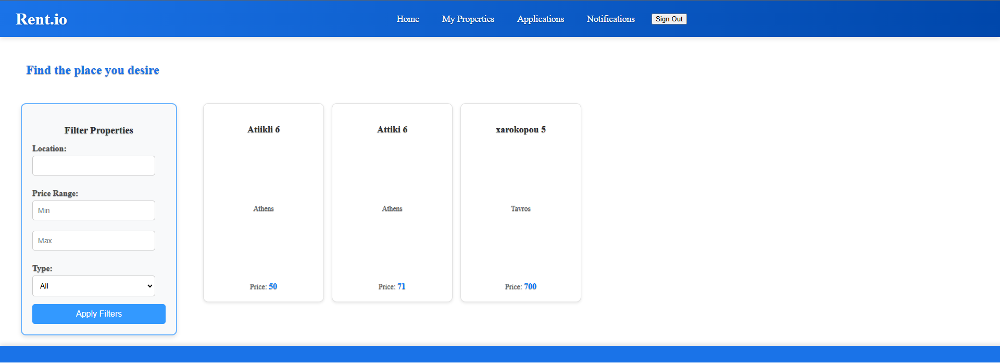

# **Rent.io**

## User Roles
The system includes the following user roles:
- **Admin**: Manages users and watches over the system.
- **Renter**: Searches for available properties and can rent them.
- **Owner**: Uploads properties to the website where Renters can rent.

## Installation
### Prerequisites
Before you begin, ensure you have the following installed on your system:
- **Java 21+** (Check with `java -version`)
- **Maven 3.9.9** (Check with `mvn -version`)
- **PostgreSQL DB**
1. Clone the repository

   Open a terminal and run the following commands on a folder of your choice:
```
   git clone https://github.com/SpyrosGew/Distributed-Systems-Project.git
   ```
2. **Connect to your DataBase**

   #### If you already have a PostgreSQL database running follow the below instructions:
   - **Update the `application.properties` with your database credentials on the following lines:
     `spring.datasource.username`, `spring.datasource.password`, `spring.datasource.url`**

   #### Else if you can install it from [here](https://dashboard.render.com/login)
   - **Login/Register to the website.**
   - **Create a new PostgreSQL database and add the needed fields.**
   - **Update the `application.properties` with your database credentials by replacing the following lines: `spring.datasource.username`, `spring.datasource.password`, `spring.datasource.url`**
   #### Otherwise, use the existing credentials, that already exist in the `application.properties` file.
3. **Run Project**

   ### You can run the project by a terminal
   - **Run the project by executing the following command:**
   ```
   mvn spring-boot:run
    ```
  

Make sure that you have the right dependencies and versions installed on your machine. You can find the dependencies and versions on the `pom.xml` file.

4.**Access to the App**
- **Open a browser and navigate to `http://localhost:8080`** and explore the application.

## Renters POV

### Registration and Login
At first a renter has to create an account on the website. He can do this by clicking on "Register" on the header


Enter your username an email and your password. Make sure select ROLE_RENTER. 

Afterwords you can log in the page by pressing "Login" on the header


Disclaimer : After you create and account and login the admin of the website has to approve you first. So until he approves you, you will be greeted with this page


### After the admin has approved you, you will be able to perform the following actions

#### At the home page you can filter houses you want to see, and you can apply for rent


#### At the My Properties page you can see the houses you have rented


#### At last at the notifications you can see updates about requests you have created. For example an application to rent a home


## Owners POV

### Registration and Login
At first an owner has to create an account on the website. He can do this by clicking on "Register" on the header


Enter your username an email and your password. Make sure select ROLE_OWNER.

Afterwords you can log in the page by pressing "Login" on the header


Disclaimer : After you create and account and login the admin of the website has to approve you first. So until he approves you, you will be greeted with this page


### After the admin has approved you, you will be able to perform the following actions

#### At the home page you can filter houses you want to see, but you cannot apply to rent one


#### At the My Properties page you can see the houses you own and also manage them.


#### At the Applications page you can see requests from renters to rent one of your propertiesc


#### At last at the notifications you can see your notifications


## Admins POV

### Registration and Login
At first an admin has to create an account on the website. He can do this by clicking on "Register" on the header


Enter your username an email and your password. Make sure select ROLE_ADMIN.

Afterwords you can log in the page by pressing "Login" on the header


#### At the home page you can filter houses you want to see, but you cannot apply to rent one


#### At the All Properties page you can see all the properties in the application and manage them


#### At the Users page you can see new user request , approve or reject them, and manage them


#### At last at the notifications you can see your notifications


